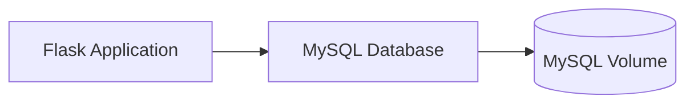

## はじめに

この記事では、DevContainerを使用してFlaskアプリケーションとMySQLデータベースを構築する手順を紹介します。  

ローカル環境を汚さずに開発環境を構築する方法として、非常に便利です。

## 目的

開発する上で、外せないのが**開発環境を整えること**。  
その環境を統一するために、今回は**Devcontainer**を使って環境構築していきます。  

DockerとDevContainerを活用して、FlaskアプリケーションとMySQLデータベースを簡単に立ち上げ、開発をスムーズに行える環境を整備します。  

## 構築内容

### 使用技術

- **Flask**: Python製の軽量なWebアプリケーションフレームワーク
- **MySQL**: リレーショナルデータベース管理システム
- **DevContainer**: Visual Studio Codeで開発環境をコンテナとして管理

---

## 環境構築手順

### 1. 必要ファイルの準備

以下のファイルを用意します。

#### Dockerfile

```bash
FROM python:3.10-bullseye

ENV GIT_VERSION=2.41.0
ENV CURL_VERSION=7.88.1

RUN apt-get update \
    && apt-get upgrade -y \
    && apt-get install -y --no-install-recommends \
        gettext=0.21-4 \
    && rm -rf /var/lib/apt/lists/* \
    && apt-get clean

# 必要なパッケージをダウンロードして解凍する
RUN curl -sL https://github.com/git/git/archive/v${GIT_VERSION}.tar.gz > v${GIT_VERSION}.tar.gz \
    && tar -zxf v${GIT_VERSION}.tar.gz \
    && rm -rf v${GIT_VERSION}.tar.gz \
    && curl -sSL https://curl.se/download/curl-${CURL_VERSION}.tar.gz > curl-${CURL_VERSION}.tar.gz \
    && tar -zxf curl-${CURL_VERSION}.tar.gz \
    && rm -rf curl-${CURL_VERSION}.tar.gz 

# git最新化
WORKDIR /git-${GIT_VERSION}
RUN apt-get remove -y git \
    && make prefix=/usr/local all \
    && make prefix=/usr/local install

# curl最新化
WORKDIR /curl-${CURL_VERSION}
RUN apt-get remove -y curl \
    && ./configure --with-openssl --enable-libcurl-option \
    && make prefix=/usr/local all \
    && make prefix=/usr/local install \
    && cp /usr/local/lib/libcurl.so.4 /usr/lib/x86_64-linux-gnu/libcurl.so.4

# 利用パッケージをインストール
COPY requirements.txt /tmp/
RUN pip3 install --no-cache-dir -r /tmp/requirements.txt

# コード配置
COPY ./ /home/work/

WORKDIR /home/work/
```

#### docker-compose.yml

```bash
version: "3"

services:
  app:
    build: .
    tty: true
    environment:
      TZ: Asia/Tokyo
    ports:
      - "80:5000"
    volumes:
      - ./:/home/work

  db:
    image: mysql:9.1.0
    environment:
      MYSQL_ROOT_PASSWORD: root
      MYSQL_USER: docker
      MYSQL_PASSWORD: docker
      MYSQL_DATABASE: app
      MYSQL_ALLOW_EMPTY_PASSWORD: 1
      TZ: "Asia/Tokyo"
    ports:
      - "3306:3306"
    volumes:
      - ./mysql-cnf/my.cnf:/etc/mysql/conf.d/my.cnf
      - ./db/init:/docker-entrypoint-initdb.d
      - vol_mysql:/var/lib/mysql

volumes:
  vol_mysql:
    driver: local
```

#### requirements.txt

```txt
SQLAlchemy==2.0.36
flask==3.1.0
```

ライブラリを入れる際はバージョンを指定します。  

#### main.py

```python
from flask import Flask

app = Flask(__name__)

@app.route('/')
def hello_world():
    return 'Hello, Flask in DevContainer!'

if __name__ == '__main__':
    app.run(host='0.0.0.0', port=5000, debug=True)
```

#### devcontainer.json

```json
{
    "name": "app",
    "dockerComposeFile": [
        "../docker-compose.yml"
    ],
    "service": "app",
    "workspaceFolder": "/home/work",
    "remoteUser": "root",
    "customizations": {
        "vscode": {
            "extensions": [
                "ms-python.python",
                "ms-python.flake8"
            ],
            "settings": {}
        }
    }
}
```

---

### コンテナ間の関係

以下のMermaid図は、FlaskアプリケーションとMySQLデータベースのサービス間の関係を示しています。



---

### 2. 開発環境の起動

1. Visual Studio Codeでプロジェクトを開きます。
2. **DevContainer: Reopen in Container** を選択します。  
(Visual Studio Codeを日本語化している場合、**コンテナーで再度開く**)  
3. コンテナ環境内でFlaskアプリケーションを実行します。

```bash
python main.py
```

ブラウザで `http://localhost` にアクセスすると、`Hello, Flask in DevContainer!` が表示されます。

---

## おわりに

この記事では、DevContainerを使ってFlaskとMySQLの開発環境を構築する手順を紹介しました。  
コンテナを活用することで、ローカル環境を汚さずに効率的に開発を進められます。ぜひ試してみてください。  

私はこういう使い方してます。こうした方がもっといい。などがあれば是非コメントで教えてもらえると助かります。
