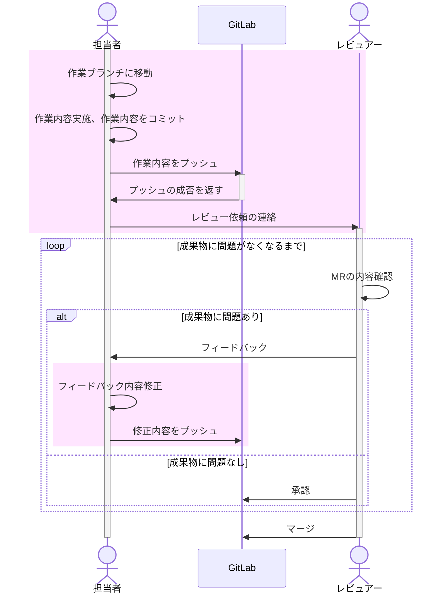
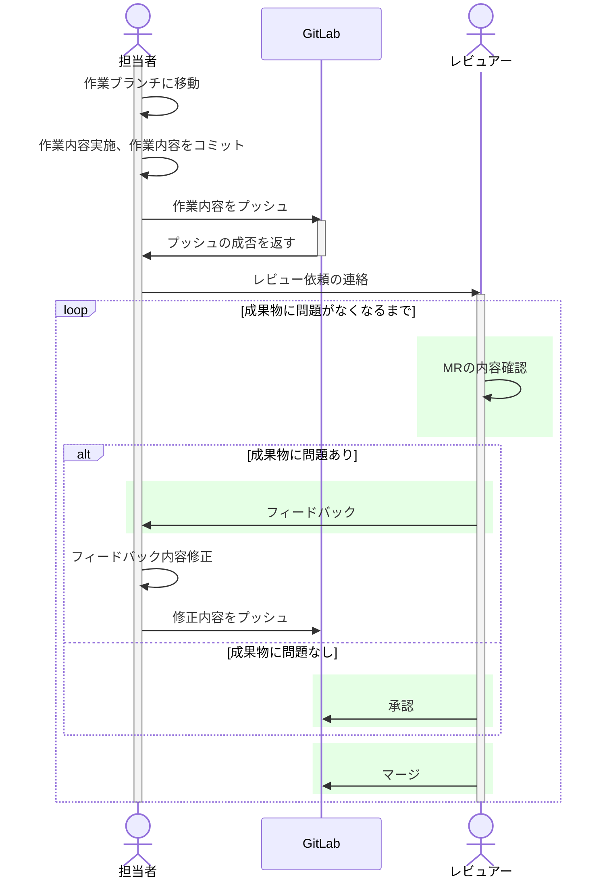

## はじめに  

本記事で、gitlab上のマージリクエスト発行からマージまでに担当者、レビュアーがすることを記載しています。  
以下の記事でマージリクエストの作成方法について記載しています。  

https://zenn.dev/secondselection/articles/_merge_request  

## マージされるまでに担当者がすること

担当者は、以下のフローの`担当者`から伸びているフローが対象となります。  



### コミット

`git commit`で作業内容をコミットします。  
コミットログを記述する際、`#{issue番号} 実施内容`とすることでgitlab上のissueとコミット内容(作業内容)を紐づけます。  

下記のようなコミットを行うことで、issueを確認すれば、作業内容に紐づく情報が後々確認できます。  

(例)  

```txt
#5 マージまでにすること 担当者側の記載を追記
```

また、コミットの粒度は`1作業で1コミット`と細かい粒度でコミットしましょう。  
複数作業をまとめてコミットすると、何か問題が発生した場合に戻すのも容易ではなくなります。  

### プッシュ

最低1日1回はプッシュするのがオススメです。  
作業ブランチをプッシュしても、他のメンバーに迷惑がかかること基本的にありません。  
プッシュしなかった場合、以下のようなケースが発生するかもしれません。  

- PCが壊れたときに何日分かの作業がすべて無くなる。
- 誤ってブランチを削除し、数日分の作業がすべて無くなる。
- gitlabに作業内容が反省されず、状況確認も確認不可となる。

※実際に起こった現象です。  

上記のようなケースを未然に回避するためにも、プッシュは小まめに行いましょう。  

### レビュー依頼

issueに記載されている実施内容を終えれば、レビュアーにレビュー依頼を出します。  
レビュー依頼前には以下の作業を実施しましょう。

- 追加・修正内容を説明(description)に記載する
- 動作確認内容を説明(description)に記載する
- DraftからResolveにフラグを更新する
  - Draft = 作業中
  - Resolve = レビュー可能状態  
- 本文がテンプレートなどに従って正しく記載されているか確認し、必要に応じて修正する

レビュー依頼はMRにてコメントが出来るようになっているので、レビュアー宛てにメンションを付けてレビュー依頼の旨を伝えましょう。  
また、別途使用しているチャットツールも併せて連絡した方が、通知漏れの削減や効率化につながります。  

上記フラグの更新は下記画像の`準備済みとしてマーク`をクリックすると、変更できます。  


また、パイプラインの失敗やコンフリクト(衝突)が発生している場合は解消してからレビュー依頼を出してください。  
以下の画像はコンフリクト発生時のものです。  
(例)  


### フィードバック内容修正

レビュー依頼を出すと、当然指摘をもらい、修正するパターンも発生します。  
指摘をもらい、修正するときは自分作業時と同じように修正内容をコミットし、プッシュします。  
指摘内容の修正が全て完了すれば、再レビューをレビュー依頼と同じように依頼しましょう。  

フィードバック内容をもらった際、下記の画像のようなスレッド形式となりますが、このスレッドは`担当者がスレッドを解決しない`ようにお願いします。  
勝手に解決してしまうと、レビュアーはどこをどんな内容で指摘したのか、再確認からしなければなりません。  

  

指摘がない場合は、レビュアーもしくは管理者がマージするので担当者の作業はここまでとなります。  

## レビュアーがすること

ここでは、レビュー方法について記載しています。  
レビュー観点は内容に応じて異なるため記載していませんのでご了承ください。  

レビュアーの担当範囲は以下です。  



### フィードバック手順

1. 以下画像の**変更**を押すと、差分が確認できます。  
  

2. 行を指定すると、その行にコメントできます。  
  

3. 入力し、今すぐコメントを追加をクリックすると入力内容がコメントとして即時反映されます。  
  

4. コメントが反映されると以下の画像のような形で表示されます。  
  

5. レビュー指摘箇所があった場合は、MRの状態を`Draft`に戻し、担当者にメンション付きでコメントしてください。  

6. Draftへの戻し方は画面右上のコードボタンの横の`・・・`(縦向き)をクリックすると、Draftに戻すボタンがあるので、そのボタンをクリックしてください。  


### 修正箇所の確認

レビュー指摘でコメントした箇所が修正された場合、修正内容を確認し、問題なければスレッドをクローズしてください。  

  

マージしてもOKな状態になったら、承認ボタンをクリックし、マージのボタンをクリックすればマージされます。  

承認すると以下のような状態になります。  
  

以下の箇所のボタンをクリックするマージされます。  
  

## さいごに

今回はマージリクエスト発行後の担当者、レビュアーがすることについて記載しました。  
Gitlab使うとレビュー効率の向上やレビューが何のためのものかがわかりやすいため重宝してます。  
今後も使っていきます。  
